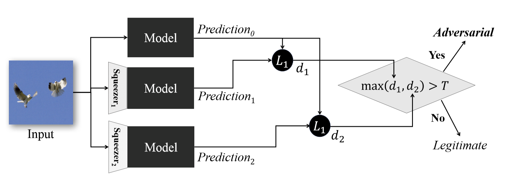
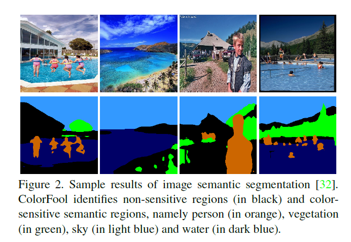
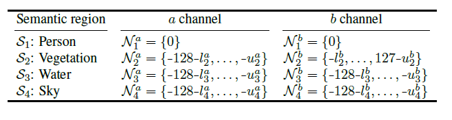

# Recap:

Tecniche di difesa:

1) Adversarial Traning, costoso
2) Gradient Masking
   * Ridurre la senzibilita' a piccoli cambiamenti nell'input 
   * Aggiunta di un Gradient penality term, calcolato come sommatoria layer per layer della norma di Frobenius calcolata sulla matrice Jacobiana 
3) Input trasformation, such as Principal Component Analysis (PCA)...

Riconoscimento di Adversarial Examples:

1) Sample statistics
2) Traning a Detector:
   * ~  Adversarial Traning, costoso
   * Addestrare un CNN/DNN a riconoscere sempi legittimi
3) Prediction Incosistency:
   * Si basa sull'incoerenza tra le previsioni.
   * Se si allenano piu' modelli, si nota che il distacco tra questi modelli su campioni legittimi e' basso.

# Feature Squeezing:

L'idea dello Feature Squeezing e' quella di utilizzare lo stesso modello per classificare piu' campioni e confrontare queste classificazione al fine di determinare se tale campione e' o non e' legittimo.
Dato un campione X, vi viene application un filtro che "riduce le caratteristiche",  la nuova immagine Y poi classificata dal modello, tale classificazione viene confrontata con quella dell'immagine iniziale.
Se la differenza e' superiore a una certa soglia allora il campione e' un campione "Aversario" altrimenti e' legittimo.

Ovviamente piu' filtri "Squeezing" possono essere usati al fine di migliorare la classificazione dei campioni avversari.

Il Feature Squeezing si basa sulle riduzione delle caratteristich, tale operazione viene effettuata in due passi:

1) Riduzione della profondita' del colore (desaturazione)
    * Loro ipotizzano infatti che riducendo il color depth, si riduca la possibilita' di un attacco, senza inficiare la qualita' della classificazione.
    Su CIFAR-10 e ImageNet hanno ridotto il color depth da 8 a 4 (per ogni canale).

2) Uso di filtri di smoothing locale e globale 
   * L'idea e' di ridurre la variazione tra i pixel e il rumore,
   * Come smoothing locale e' stato usato il Gaussian blur (kernel 2x2)
   * Come smoothing globale e' stato usato il "denoising" implementato in OpenCV, che converte l'immagine da RGB a CIELAB space, applicata un senoiser alla componente L e AB, e poi la riconverte in RGB 

Questo metodo ha il beneficio di essere abbastanza accurato e poco costoso.

***********************************************************************************************************************************************************************************************************************************************************************************

# ColorFool: Semantic Adversarial Colorization

Authors: Ali Shahin Shamsabadi, Ricardo Sanchez-Matilla, Andrea Cavallaro

Link to paper: https://arxiv.org/pdf/1911.10891.pdf

# General info about the paper:

The authors propose ColorFool : a content-based black-box adversarial attack that generates unrestricted (low-frequency) perturbations by exploiting image semantics to selectively modify colors within chosen ranges that are perceived as natural by humans. ColorFool operates only on the de-correlated a and b channels of the Lab color space without changing the lightness L. Also, introduces perturbations only within a chosen natural-color range for specific semantic categories. ColorFool is appliable on images of any size.
The evaluation and validation is based on: 

- success rate, robustness to defense frameworks and transferability; 

- compared with 5 state-of-the-art adversarial attacks(Basic Iterative Method-BIM; Translation-Invariant BIM;DeepFool;SparseFool;SemanticAdv; BigAdv was excluded since no code was available) on 2 different tasks(scene and object classification);

- 3 state-of-the-art DNN classifiers under attack (ResNet18, ResNet50, AlexNet) with 3 standard datasets (Private-Place365-scene classification db; CIFAR-10-object classification db; ImageNet-object classification db)

Note: the perturbations can be restricted (by controlling the  , such as , ,,) or unrestricted which span a wider range as determined by different colorization approaches.

Defenses used:

- requantization (feature squeezing paper), median filter (feature squeezing paper) and JPEG compression: to remove adversarial perturbation prior to classification
-  improve robustness of the classifier through adversarial training or by changing the loss functions

An attack should be: robust (able to mislead a classifier in presence of defense frameworks), tranferable (able to mislead an unseen classifier), unnoticeable/undetectable (the shape and spatial arrangement of objects in the adversarial image should be perceived as in the clean image and the colors should look natural).

## How does ColorFool work

Uses image segmentation to identify image regions. These image regions are classified in 2 categories: 	
-sensitive regions: the colors/appereance of these regions are typically within a specific range and unusual colors would attract the attention of a human observer. Here we have 4 categories of sensitive regions: person, sky, vegetation(grass, trees, etc), water(rivers, sea, lake, swimming pool, etc).
-non-sensitive regions: may have their colors modified withing an arbitrary range and still look natural.

Firstly, an image  is decomposed in  semantic regions:

where  is a binary mask that specifies the location of pixels to regions  and " " denotes a pixel-wise multiplication.

Binary masks are outputted by a pyramid Pooling R50-Dilated architecture of Cascade Segmentation Module segmentation trained on MIT ADE20k dataset on 150 semantic regions types.

Then, the regions are divided into sensitive () and non-sensitive regions () such that ,where  is the union operator.

After identifying these two sets of regions , the colors of the regions are modified in the Lab color space, which separates color information from brightness: 

 - a ranges from green(-128) to red (+127)
 - b ranges from blue(-128) to yellow (+127)
 - L ranges from black(0) to white (100)

The sensitive regions are modified and the adversarial set is generated according to the following formula :

where  converts the intensities of an image from RGB to the Lab color space,  and  are the adversarial perturbations in the channels  and  that are chosen randomly from the set of natural-color ranges,  and    in the  and  channels. 
These ranges are defined based on the actual colors, region semantics and prior knowledge about color perception in that region type as shown in the following table:

Note that no color changes are applied to image regions classified as person.

Multiple trials are allowed until a perturbation misleads the classifier. To avoid large color changes in the first trials the perturbations is scaled down by a factor alpha = n/N, where n is the index of the trial and N is the max number of trials.

The non-sensitive regions are also modified as follows:

where  and  are  chosen randomly inside the whole range of  and , since the regions can undergo larger intensity changes.

Finally, the adversarial image generated by ColorFool combines the modified sensitive and non-sensitive regions as:

where  is the quantization function which ensures that the generated adversarial image is in the dynamic range of pixel values and  is the inverse function that converts the intensities of an image from Lab to the RGB color space.

## Validation

Algorithms under comparison: BIM, TI-BIM, DeepFool, SparseFool, SemanticAdv (BigAdv excluded because no code was available)

Datasets: Private-Places365, CIFAR-10, ImageNet

Classifiers under attack: ResNet18, ResNet50, AlexNet

Performance measures: 

 - success rate in misleading a classifier
 - robustness to defenses (requantization, median filter, lossy jpeg compression and report SR and undetectability; evaluate SR when attacking a seen classifier trained with Prototype Conformity Loss and adversarial training)
 - image quality of the adversarial images (using NIMA: neural image assessment, trained on AVA dataset; NIMA estimates the perceived image quality and was shown to predict human preferences)

## Results

SR:

 - all adversarial attacks achieve higher SR in a seen classifier

 - unrestricted attacks achieve higher SR than restricted attacks (in unseen classifiers)
 - ColorFool achieves high SR on both seen and unseen classifiers
 - unrestrcited attacks obtain high transferability rates

Robustness:

 - the most robust attacks are the unrestricted ones where Colorfool, Colorfool-r (no priors are considered for the sematic regions) and SemanticAdv consistently obtain a SR above 60% across datasets and classifiers
 - restricted attacks are more detectable than unrestricted ones when considering all image filters across all classifiers and datasets.
 - restricted attacks generate high-frequency adversarial perturbations whereas unrestricted attacks generate low-frequency perturbations (these ones are more robust to requantization, median filter and jpeg compression). NOTE: Jpeg compression is the most effective detection framework.
 - the robustness of the adversarial images is proportional to the accuracy of the classifier use for their generation.
 - ColorFool is robust when misleading ResNet110 equipped with both PCL and adversarial training defenses (adversarial images generated by BIM)

Quality:

 - restricted attacks such as TI-BIM or SparseFool generate adversarial images with minimal perturbations but they are noticeable
 - SemanticAdv and ColorFool-r generate unrealistic colors
 - ColorFool generate image that look natural even though they are largely different from the clean images.
 - unrestricted attacks obtain the highest NIMA scores across all attacks, classifiers and datasets
 - ColorFool obtains equal or higher NIMA scores than the clean images considering all datasets and classifiers

